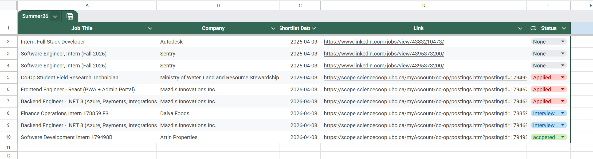
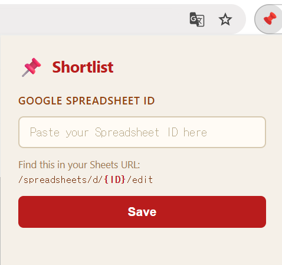
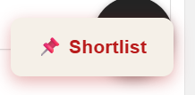

# 📌 Shortlist

A Chrome Extension (Manifest V3) that saves job postings from **LinkedIn** and **UBC Scope Portal** to a Google Spreadsheet with one click.

---





## What it does

On any supported job posting page, a floating **📌 Shortlist** button appears at the bottom-right corner of the screen. Click it and the extension automatically:

1. Parses the **job title** and **company name** from the page
2. Records **today's date**
3. Captures the **URL** (canonical permalink)
4. Appends a new row to your Google Sheet
5. Auto-resizes columns A–D to fit the content

---

## Supported Sites

| Site | URL Pattern |
|---|---|
| LinkedIn | `linkedin.com/jobs/search-results/*`, `linkedin.com/jobs/view/*` |
| UBC Scope | `scope.sciencecoop.ubc.ca/*` |

---

## Spreadsheet Format

| A | B | C | D |
|---|---|---|---|
| Job Title | Company | Shortlisted Date | Link |

> Row 1 (header) is created manually by you. The extension always appends after existing rows.
> The sheet tab must be named **`Sheet1`** (Google Sheets default).

---

## Setup

### 1. Load the Extension

1. Go to `chrome://extensions`
2. Enable **Developer mode** (top-right toggle)
3. Click **Load unpacked** → select the `Shortlist` folder
4. Pin the extension to your toolbar

### 2. Create a Google Sheet

1. Go to [Google Sheets](https://sheets.google.com) and create a new spreadsheet
2. In Row 1, add headers: `Job Title` | `Company` | `Shortlisted Date` | `Link`
3. Copy the Spreadsheet ID from the URL:
   ```
   https://docs.google.com/spreadsheets/d/{SPREADSHEET_ID}/edit
   ```

### 3. Paste the Spreadsheet ID

1. Click the Shortlist icon in Chrome toolbar
2. Paste your Spreadsheet ID into the input field
3. Click **Save**

### 4. Use it

1. Navigate to a LinkedIn or UBC Scope job posting page
2. Click the **📌 Shortlist** button at the bottom-right
3. On first use, Chrome will ask you to authorize Google Sheets access — click Allow
4. Check your spreadsheet for the new row ✅

---

## Button States

| State | Label | Meaning |
|---|---|---|
| Default | `📌 Shortlist` | Ready to save |
| Loading | `⏳ Saving…` | Writing to Sheet |
| Success | `✅ Saved!` | Row appended |
| Error | `❌ Failed` / `❌ Parse failed` | See console for details |

---

## Tech Stack

- **Manifest V3** Chrome Extension
- **Vanilla JS** — no bundler, no frameworks
- **Google Sheets API v4** — append rows + auto-resize columns
- **Chrome Identity API** — OAuth 2.0 (no manual API keys)
- **Content Scripts** — per-site DOM parsing
- **Service Worker** — background message handler

---

## File Structure

```
shortlist/
├── manifest.json
├── background.js          # Service worker: OAuth + Sheets API
├── content/
│   ├── linkedin.js        # LinkedIn job page parser
│   └── scope.js           # UBC Scope Portal parser
├── popup/
│   ├── popup.html
│   ├── popup.js
│   └── popup.css
└── icons/
    ├── icon16.png
    ├── icon48.png
    └── icon128.png
```

---

## Troubleshooting

**Button doesn't appear**
- Reload the extension in `chrome://extensions` (↺ button)
- Close and reopen the tab (F5 alone may not pick up extension changes)

**❌ Parse failed**
- LinkedIn: make sure you're on a job posting page with a job selected
- UBC Scope: navigate into a specific job posting detail page

**❌ Set Sheet ID**
- Click the extension icon and paste your Spreadsheet ID

**Sheet name error**
- Ensure the sheet tab at the bottom of your spreadsheet is named `Sheet1`

---

## Privacy

- No data is sent anywhere except your own Google Spreadsheet
- OAuth tokens are managed by Chrome and never stored by the extension
- No analytics, no tracking
